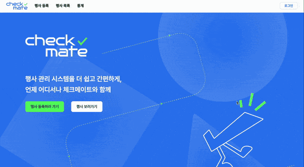
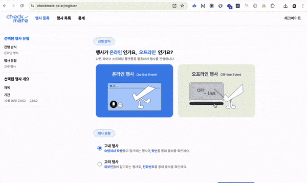
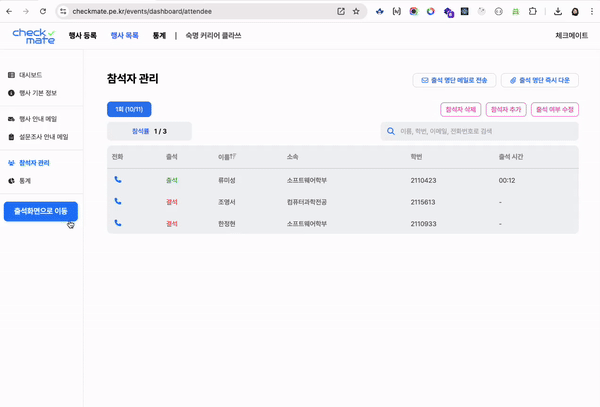
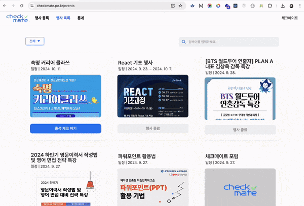
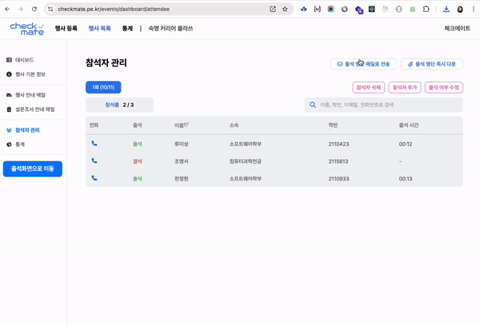

  <h1>CheckMate | 체크메이트</h1>
  
내 손 안에 간편한 행사 관리 시스템

## 🗂️ 목차

1. [**웹 서비스 소개**](#1)
2. [**개발 기간**](#2)
3. [**주요 기능 데모 영상**](#3)
4. [**개발 팀 소개**](#4)
5. [**버전 기록**](#5)

 

## 💁🏻 웹 서비스 소개

행사 참석자들의 출석 확인을 쉽고 빠르게 하고, 주최자가 참석 이력을 효율적으로 관리할 수 있는 서비스를 제공한다.

 

## 📅 개발 기간

2024.05.05 ~ 2024.09.27

 

## 🎥 주요 기능 데모 영상

|                                              온보딩 페이지                                               |
| :------------------------------------------------------------------------------------------------------: |
|  |

|                                                 행사 등록 페이지                                                 |
| :--------------------------------------------------------------------------------------------------------------: |
|  |

|                                       출석 체크 기능 (학번 입력 및 서명)                                       |
| :------------------------------------------------------------------------------------------------------------: |
|  |

|                                                  행사 목록 및 행사 상세 페이지                                                  |
| :-----------------------------------------------------------------------------------------------------------------------------: |
|  |

|                                                     참석자 명단 다운로드 기능                                                      |
| :--------------------------------------------------------------------------------------------------------------------------------: |
|  |

 

## 🏄🏻‍♀️ 개발 팀 소개

<table style="text-align:center">
  <thead>
    <tr>
      <th style="text-align: center;">프로필</th>
      <th style="text-align: center;">이름 (세부 전공)</th>
      <th style="text-align: center;">역할</th>
    </tr>
  </thead>
  <tbody>
    <tr>
      <td></td>
      <td style="text-align: center;">류미성 (컴퓨터과학 21)</td>
      <td>Front-end</td>
    </tr>
    <tr>
      <td></td>
     <td style="text-align: center;">한정현 (컴퓨터과학 21)</td>
      <td>Front-end</td>
    </tr>
    <tr>
      <td></td>
      <td style="text-align: center;">조영서 (컴퓨터과학 21)</td>
      <td>Back-end</td>
    </tr>
  </tbody>
</table>

 

## 👷 버전 기록

|   버전   | 
업데이트 내용
                                                                                                                      | 업데이트 날짜 |
| :------: | :----------------------------------------------------------------------------------------------------------------------------------------------------------- | :-----------: |
| `v1.0.0` | - 체크메이트 서비스 오픈 - 출석체크 기능 구현                                                                                                            |  24. 05. 12   |
| `v1.1.0` | - 출석체크 플로우 수정 (모달창 간소화) - 참석명단 조회 기능 추가                                                                                         |  24. 05. 19   |
| `v1.2.0` | - 참석명단 이메일로 전송 기능 추가                                                                                                                           |  24. 05. 25   |
| `v1.3.0` | - 반응형 구현 - 행사 상세 페이지 내 참석여부 확인 기능 구현  - 행사 참석자 전화 연결 기능 구현 - 행사 등록 페이지 구현                            |  24. 07. 11   |
| `v2.0.0` | - 대시보드 페이지 구현 (관리자 페이지)   - 휴대전화 뒷번호로 출석체크 하는 기능 구현   - 행사 진행 상태 표시                                        |  24. 07. 24   |
| `v2.1.0` | - 참석자 명단을 담당자 메일로 자동 발송 기능 구현                                                                                                            |  24. 07. 26   |
| `v2.1.1` | - 행사 등록 페이지 내 오류 해결                                                                                                                              |  24. 08. 16   |
| `v3.0.0` | - 행사 목록 페이지 생성  - 모든 페이지의 디자인 수정                                                                                                      |  24. 09. 05   |
| `v3.0.1` | - 행사별 세부 통계 및 전체 통계 기능 구현  - 행사 목록 검색 기능 구현   - 구글 로그인 구현  - 행사 리마인드 예약 발송, 설문조사 링크 발송 기능 구현 |  24. 09. 26   |

 
